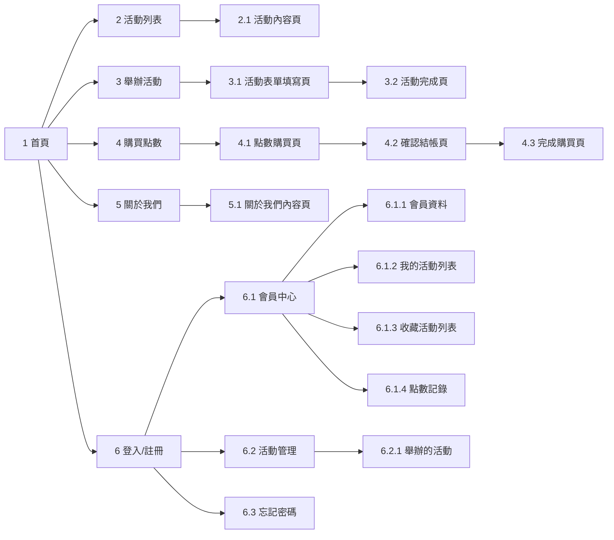

```mermaid
graph LR;
  A[1 首頁]
  A --> B[2 活動列表]
  B --> B1[2.1 活動內容頁]
  
  A --> C[3 舉辦活動]
  C --> C1[3.1 活動表單填寫頁]
  C1 --> C2[3.2 活動完成頁]

  A --> D[4 購買點數]
  D --> D1[4.1 點數購買頁]
  D1 --> D2[4.2 確認結帳頁]
  D2 --> D3[4.3 完成購買頁]

  A --> E[5 關於我們]
  E --> E1[5.1 關於我們內容頁]

  A --> F[6 登入/註冊]
  F --> F1[6.1 會員中心]
    F1 --> F1_1[6.1.1 會員資料]
    F1 --> F1_2[6.1.2 我的活動列表]
    F1 --> F1_4[6.1.3 收藏活動列表]
    F1 --> F1_5[6.1.4 點數記錄]
  F --> F2[6.2 活動管理]
    F2 --> F2_1[6.2.1 舉辦的活動]
  F --> F3[6.3 忘記密碼]

```